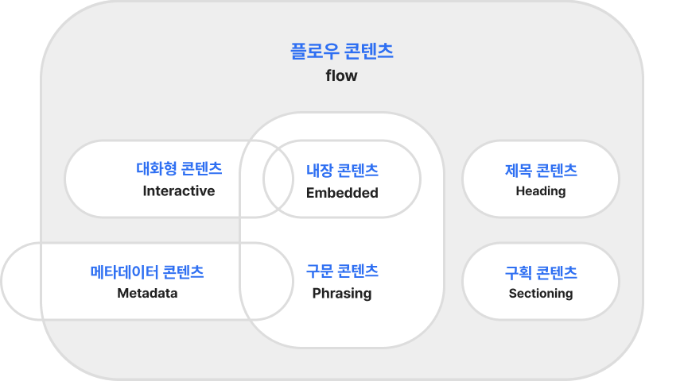
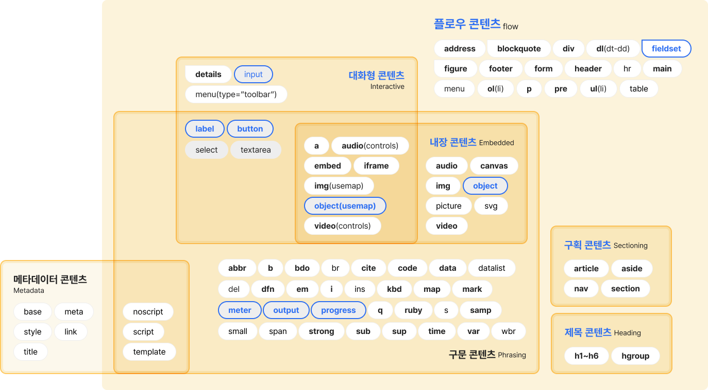

# HTML5태그 기본 part2

Date: 2025년 2월 27일
페이지: P.71~P.100
완료: Yes

## 1. HTML 엔티티 코드

| 문자 | 엔티티 | 설명 |
| --- | --- | --- |
| 공백 | `&nbsp;` | 공백 문자 |
| `<` | `&lt;` | less-than 기호 |
| `>` | `&gt;` | greater-than 기호 |
| `&` | `&amp;` | 앰퍼샌드 |
| `"` | `&quot;` | 큰따옴표 |
| `'` | `&apos;` | 작은따옴표 |
| © | `&copy;` | 저작권 기호 |

```html
<!DOCTYPE html>
<html lang="ko">
<head>
  <meta charset="UTF-8">
  <title>HTML 엔티티 코드 예제</title>
  <style>
    body { font-family: Arial, sans-serif; margin: 20px; }
    p { margin: 5px 0; }
  </style>
</head>
<body>
  <h2>HTML 엔티티 코드 사용 예제</h2>
  <p>공백: <code>&amp;nbsp;</code> → 결과: A&nbsp;B</p>
  <p>Less-than: <code>&amp;lt;</code> → 결과: &lt;</p>
  <p>Greater-than: <code>&amp;gt;</code> → 결과: &gt;</p>
  <p>Ampersand: <code>&amp;amp;</code> → 결과: &amp;</p>
  <p>Double Quote: <code>&amp;quot;</code> → 결과: &quot;</p>
  <p>Single Quote: <code>&amp;apos;</code> → 결과: &apos;</p>
  <p>Copyright: <code>&amp;copy;</code> → 결과: ©</p>
</body>
</html>

```

---

## 2. 텍스트 관련 태그

| 태그 | 설명 |
| --- | --- |
| `<strong>` | 페이지에서 가장 중요한 내용을 강조하며 볼드체로 표시 |
| `<b>` | 사용하지 않음 (의미론적이지 않으므로 대체 권장) |
| `<em>` | 텍스트에 강조 효과를 주며 이탤릭체로 표시 |
| `<i>` | 단순 이탤릭체 (필수 강조가 아닌 경우 사용) |
| `<q>` | 짧은 인용문을 위한 인라인 태그 |
| `<blockquote>` | 긴 인용문을 위한 블록 형식 태그 |
| `<cite>` | 인용의 출처를 표기 |
| `<address>` | 연락처 정보 또는 기관, 단체 이름을 기입 (필수) |
| `<mark>` | 형광펜 효과로 텍스트를 강조 |
| `<dfn>` | 용어 정의에 사용 |
| `<abbr>` | 약어를 나타내며, 마우스 오버 시 툴팁으로 전체 의미 제공 |
| `<sup>` | 윗첨자 |
| `<sub>` | 아랫첨자 |
| `<kbd>` | 사용자 키보드 입력을 표시 |

```html
<!DOCTYPE html>
<html lang="ko">
<head>
  <meta charset="UTF-8">
  <title>텍스트 관련 태그 예제</title>
  <style>
    body { font-family: Arial, sans-serif; margin: 20px; }
    blockquote { margin: 10px 20px; font-style: italic; color: #555; }
  </style>
</head>
<body>
  <h2>텍스트 관련 태그 사용 예제</h2>
  <p><strong>Strong 태그:</strong> 이 텍스트는 중요한 내용을 강조합니다.</p>
  <p><em>Em 태그:</em> 이 텍스트는 기울임체로 강조됩니다.</p>
  <p>짧은 인용문: <q cite="<https://example.com>">짧은 인용문 내용</q></p>
  <blockquote cite="<https://example.com>">
     긴 인용문 예제: Lorem ipsum dolor sit amet, consectetur adipiscing elit.
  </blockquote>
  <p><cite>출처: Example Source</cite></p>
  <address>
    서울, 대한민국<br>
    전화: 010-1234-5678
  </address>
  <p>형광펜 효과: <mark>중요한 텍스트 강조</mark></p>
  <p>용어 정의: <dfn title="HyperText Markup Language">HTML</dfn>은 웹 문서를 작성하기 위한 언어입니다.</p>
  <p>약어 설명: <abbr title="World Wide Web">WWW</abbr>는 인터넷의 핵심 개념입니다.</p>
  <p>윗첨자: 10<sup>2</sup> = 100</p>
  <p>아랫첨자: H<sub>2</sub>O</p>
  <p>키보드 입력 표시: Press <kbd>Ctrl</kbd> + <kbd>C</kbd> to copy.</p>
</body>
</html>

```

---

## 3. 콘텐츠 카테고리

콘텐츠 카테고리에 해당하는 이미지는 아래와 같이 첨부합니다.





---

## 4. Video 태그 속성

| 속성 | 설명 |
| --- | --- |
| `src` | 비디오 파일의 경로 |
| `poster` | 재생 전 표시할 기본 이미지 |
| `preload` | 비디오를 재생하기 전에 모두 불러오기 |
| `autoplay` | 페이지 로드 시 자동 재생 |
| `loop` | 비디오의 반복 재생 |
| `controls` | 재생, 일시정지 등 컨트롤 버튼 삽입 |
| `width` | 비디오의 너비 |
| `height` | 비디오의 높이 |

```html
<!DOCTYPE html>
<html lang="ko">
<head>
  <meta charset="UTF-8">
  <title>비디오 태그 예제</title>
  <style>
    body { font-family: Arial, sans-serif; margin: 20px; }
  </style>
</head>
<body>
  <h2>비디오 태그 사용 예제</h2>
  <p>아래 비디오는 다양한 속성을 포함하고 있습니다.</p>
  <video src="path/to/video.mp4" poster="path/to/poster.jpg" preload="auto" autoplay loop controls width="640" height="360">
    브라우저가 &lt;video&gt; 태그를 지원하지 않습니다.
  </video>
</body>
</html>

```

---

## 5. **입력 양식 태그**

### 5.1 Form 및 기본 입력 요소

| 태그/속성 | 설명 |
| --- | --- |
| `<form method="get" or "post">` | 폼의 시작 태그 (전송 방식을 선택) |
| `<input type="...">` | 다양한 입력 유형 (텍스트, 체크박스, 파일 등) |
| `<button>` | 일반 버튼 |
| `<label>` | 입력 필드에 대한 설명을 제공 |

### 5.2 다양한 입력 타입

| 입력 타입 | 설명 |
| --- | --- |
| `checkbox` | 체크박스 |
| `file` | 파일 선택 입력 |
| `hidden` | 숨겨진 입력 필드 |
| `image` | 이미지 형태의 버튼 |
| `password` | 비밀번호 입력 필드 |
| `radio` | 라디오 버튼 (동그란 체크박스) |
| `reset` | 입력 내용 초기화 |
| `submit` | 폼 제출 버튼 |
| `text` | 기본 텍스트 입력 |
| `color` | 색상 선택 |
| `date` | 날짜 선택 |
| `datetime` | 날짜 및 시간 선택 |
| `datetime-local` | 지역 기반 날짜 및 시간 선택 |
| `email` | 이메일 주소 입력 |
| `month` | 월 선택 |
| `number` | 숫자 입력 |
| `range` | 범위 선택 (슬라이더) |
| `search` | 검색어 입력 |
| `tel` | 전화번호 입력 |
| `time` | 시간 선택 |
| `url` | 주소(URL) 입력 |
| `week` | 주 선택 |

```html
<!DOCTYPE html>
<html lang="ko">
<head>
  <meta charset="UTF-8">
  <title>입력 양식 태그 예제</title>
  <style>
    body { font-family: Arial, sans-serif; margin: 20px; }
    fieldset { margin-bottom: 20px; padding: 10px; }
    label { display: inline-block; width: 120px; }
    input, button { margin: 5px 0; }
  </style>
</head>
<body>
  <h2>입력 양식(폼) 태그 사용 예제</h2>
  <form action="/submit" method="post">
    <fieldset>
      <legend>사용자 정보 입력</legend>
      <label for="username">이름:</label>
      <input type="text" id="username" name="username" placeholder="이름 입력"><br>
      <label for="email">이메일:</label>
      <input type="email" id="email" name="email"><br>
      <label for="password">비밀번호:</label>
      <input type="password" id="password" name="password"><br>
      <label for="color">좋아하는 색상:</label>
      <input type="color" id="color" name="color"><br>
      <label for="date">예약 날짜:</label>
      <input type="date" id="date" name="date"><br>
      <label for="range">선호도 (1-10):</label>
      <input type="range" id="range" name="range" min="1" max="10"><br>
      <button type="submit">제출</button>
      <button type="reset">초기화</button>
    </fieldset>
  </form>
</body>
</html>

```

---

## 6. 입력 태그 이외의 폼 요소

| 태그 | 설명 |
| --- | --- |
| `<textarea>` | 다중 줄 텍스트 입력 영역 |
| `cols`, `rows` | `<textarea>`의 너비와 높이를 지정 |
| `<select>` | 드롭다운 선택 양식 생성 |
| `<optgroup>` | `<select>` 내 옵션들의 그룹화 |
| `<option>` | 선택 가능한 항목 생성 |
| `<fieldset>` | 관련 입력 요소들을 그룹으로 묶고 설명 추가 |
| `<legend>` | `<fieldset>`의 제목을 지정 (자식 태그) |

```html
<!DOCTYPE html>
<html lang="ko">
<head>
  <meta charset="UTF-8">
  <title>추가 입력 요소 예제</title>
  <style>
    body { font-family: Arial, sans-serif; margin: 20px; }
    fieldset { margin-bottom: 20px; padding: 10px; }
    label { display: block; margin-top: 10px; }
    textarea { width: 300px; }
  </style>
</head>
<body>
  <h2>추가 입력 요소 (textarea, select 등) 예제</h2>
  <form action="/submit" method="post">
    <fieldset>
      <legend>추가 정보 입력</legend>
      <label for="bio">자기소개:</label>
      <textarea id="bio" name="bio" cols="30" rows="5" placeholder="자기소개를 입력하세요."></textarea>

      <label for="country">국가 선택:</label>
      <select id="country" name="country">
        <optgroup label="아시아">
          <option value="kr">한국</option>
          <option value="jp">일본</option>
        </optgroup>
        <optgroup label="유럽">
          <option value="de">독일</option>
          <option value="fr">프랑스</option>
        </optgroup>
      </select>
    </fieldset>
  </form>
</body>
</html>

```

---

## 7. 공간 분할 태그

| 태그 | 설명 |
| --- | --- |
| `<div>` | 블록(Block) 형식의 컨테이너 (구역을 구분) |
| `<span>` | 인라인(In-line) 형식의 컨테이너 |

```html
<!DOCTYPE html>
<html lang="ko">
<head>
  <meta charset="UTF-8">
  <title>공간 분할 태그 예제</title>
  <style>
    body { font-family: Arial, sans-serif; margin: 20px; }
    .container { border: 1px solid #000; padding: 10px; }
    .highlight { color: blue; }
  </style>
</head>
<body>
  <h2>공간 분할 태그 사용 예제</h2>
  <div class="container">
    이 영역은 `<div>` 태그로 블록 단위로 구분됩니다.
    <span class="highlight">이 텍스트는 `<span>` 태그로 인라인 스타일을 적용한 예제입니다.</span>
  </div>
</body>
</html>

```

---

## 8. 시멘틱 구조 (Semantic Structure)

웹페이지 전체 레이아웃을 효과적으로 구분하는 데 사용되는 시멘틱 태그입니다.

| 태그 | 설명 |
| --- | --- |
| `<header>` | 페이지의 머리말 영역 (로고, 제목, 내비게이션 등) |
| `<nav>` | 주요 내비게이션 메뉴 |
| `<aside>` | 보조 내용 (사이드바, 위젯 등) |
| `<section>` | 페이지 내의 독립적인 구획 |
| `<article>` | 독립적이며 자급자족하는 콘텐츠 영역 |
| `<footer>` | 페이지의 바닥글 영역 (저작권, 연락처 정보 등) |

```html
<!DOCTYPE html>
<html lang="ko">
<head>
  <meta charset="UTF-8">
  <title>시멘틱 구조 예제</title>
  <style>
    body { font-family: Arial, sans-serif; margin: 20px; }
    header, nav, aside, article, footer {
      border: 1px solid #ccc;
      margin: 10px 0;
      padding: 10px;
    }
    nav ul { list-style-type: none; padding: 0; }
    nav li { display: inline; margin-right: 10px; }
  </style>
</head>
<body>
  <h2>시멘틱 구조 사용 예제</h2>
  <header>
    <h1>웹페이지 제목</h1>
    <nav>
      <ul>
        <li><a href="#">홈</a></li>
        <li><a href="#">소개</a></li>
        <li><a href="#">연락처</a></li>
      </ul>
    </nav>
  </header>

  <aside>
    <h3>사이드바</h3>
    <p>보조 정보나 위젯 등이 배치되는 영역입니다.</p>
  </aside>

  <article>
    <h2>메인 콘텐츠</h2>
    <p>주요 내용이 담긴 영역입니다.</p>
    <section>
      <h3>세부 섹션</h3>
      <p>주제에 대한 자세한 내용이 다뤄집니다.</p>
    </section>
  </article>

  <footer>
    <p>&copy; 2023 예제 사이트. All rights reserved.</p>
  </footer>
</body>
</html>

```

---

[HTML5태그 기본 part2 퀴즈와연습문제](https://linen-artichoke-b37.notion.site/HTML5-part2-1b32ad07fb20803e9c68c344a991a3e5?pvs=4)